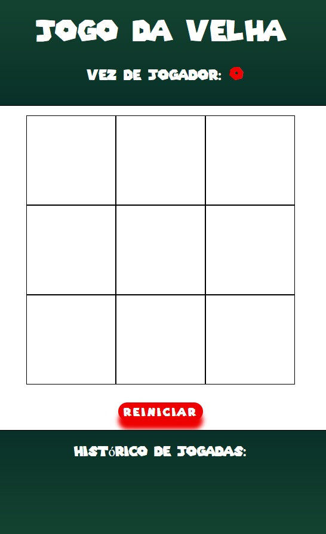

# Jogo da Velha - Tic Tac Toe
Projeto realizado utilizando a biblioteca front-end JavaScript, Reactjs, com o objetivo de aprofundar e explorar conhecimentos relacionados à biblioteca, tendo como principal os conceitos de componetização na criação de interfaces de usuário interativas, que, no caso desse projeto serviu para a construção de um conhecido jogo... O Jogo da Velha.

Com esse projeto é possivel aplicar e demonstrar a minha experiencia no que se diz respeito a tratamento, manipulação e demais operações com vetores, assim como um uso dinamico e eficiente de conceitos intrinsecos a biblioteca React, como States, Props, Components, JSX e entre outros que foram utilizados de forma integra para o desenvolvimento e funcionalidade do jogo. 

Nesse sentido além de ter desenvolvido apenas um simples jogo da velha, adicionei ao tradicional a possibilidade de reiniciar a partida vigente e tambem a possibilidade de retornar a uma jogada ja realizada pelo usuário.

>[!NOTE]
Enfoca-se nas funções JSX presentes no arquivo Jogo.jsx, que serve como componente central e essencial no bom funcionamento e dinamicidade da aplicação.
>
>[Analise o código clicando aqui](./jogo-da-velha/src/componentes/Jogo.jsx)

## Screenshots da interface da aplicação web Jogo Da Velha:
### Primeiro Acesso:

### Preenchido:

## Para acessar a aplicação clique no link abaixo:
[Jogo da Velha em ReactJs](https://jogo-da-velha-reactjs.netlify.app/)
